<table>
<tr>
<td valign="top"></td>
<td valign="top" align="center">
 

  

</td>
</tr>
</table>

## Hi 👋! My name is Farzad and I'm a passionate developer

###  Languages

### 🛠️ Tools & Frameworks

### 🚀  DevOps & Automation

---

